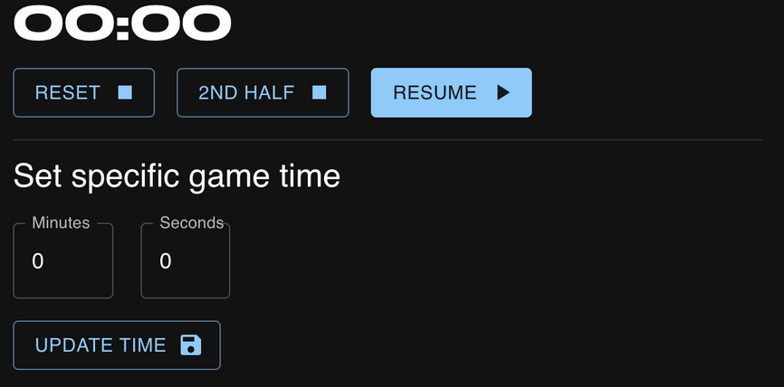

# OBS Studio Football Timer

An OBS plugin that can be imported as browser source to display a timer.

## Install

- Download the `build.zip` file
- Extract the zip file
- Go to OBS Studio and import the `build/index.html` file as a `Browser source`
- Crop just the timer and move to your desired place

### Include the timer in multiple scenes

- Add the source to one of the scenes
- Right-click on it and `Copy`
- Go to other scene, right-click on the sources area and select `Paste (reference)`

## Usage

- Click on the timer source
- Press `Interact`
- Use the buttons and the inputs to manage the timer as you need

## Buttons
- Reset: Pauses the timer and puts it to 00:00
- 2nd half: Pauses the timer and puts it to 45:00
- Resume/Play: Resume/Plays the timer
- Update Time: Pauses the timer and sets it to the values defined for minutes and seconds